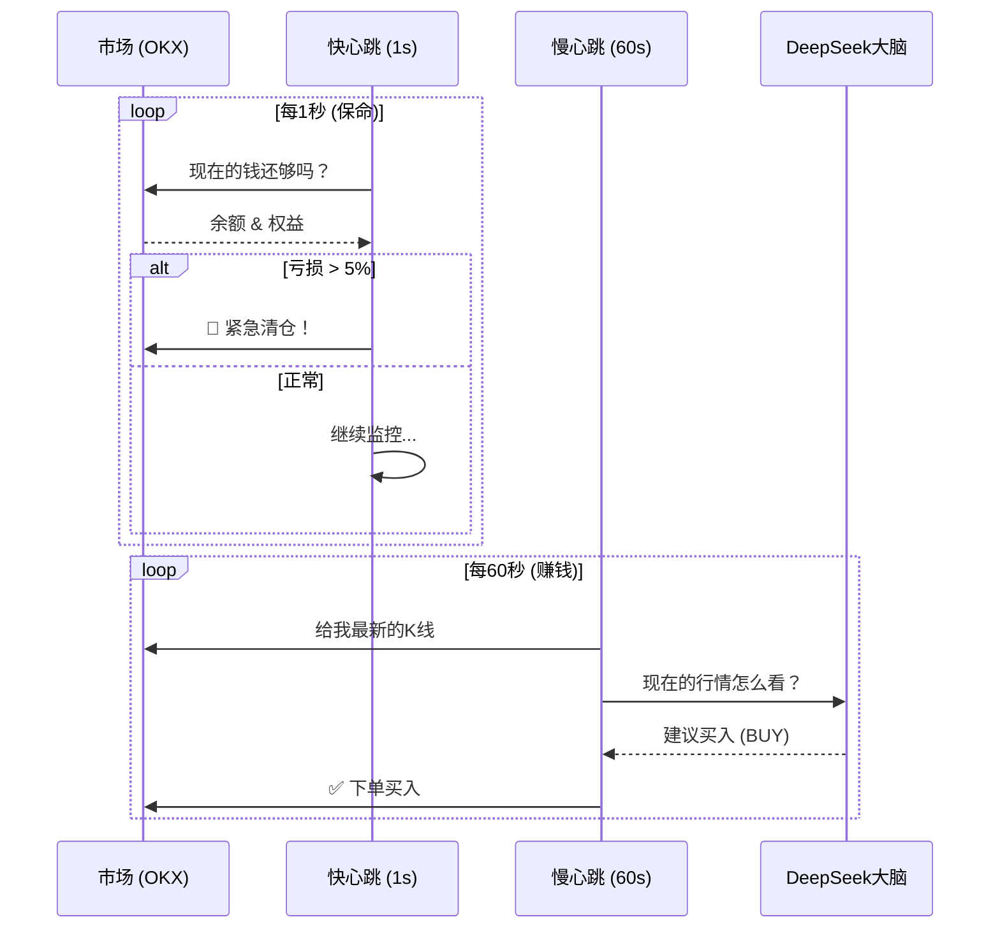

# CryptoOracle 交易全流程逻辑图解

本文档旨在用最直观的流程图和步骤说明，帮您理清 **机器人 (Python)** 与 **大脑 (AI)** 是如何协同工作的。

---

## 1. 核心角色分工

| 角色 | 身份 | 职责 (Job Description) | 频率 |
| :--- | :--- | :--- | :--- |
| **Python 主程序** | **躯体 & 反射神经** | 负责跑腿（下单）、管钱（风控）、条件反射（止损）。 | **极快 (1秒/次)** |
| **DeepSeek AI** | **大脑 & 决策者** | 负责看盘（K线分析）、判断方向（买/卖）、制定策略。 | **较慢 (60秒/次)** |

---

## 2. 完整生命周期 (The Lifecycle)

### 阶段一：启动与初始化 (Initialization)
> **目的**: 搞清楚“我有多少钱？”、“我之前买了啥？”

1.  **连接交易所**: 验证 API Key，确定是实盘还是模拟盘。
2.  **资产盘点**:
    *   扫描账户 USDT 余额。
    *   扫描当前所有持仓 (Position)。
    *   **计算总家底**: `总权益 = 余额 + 持仓市值`。
3.  **基准锁定 (Lock Baseline)**:
    *   读取配置 `initial_balance` (例如 100U)。
    *   如果 `总权益 (110U) > 配置 (100U)` -> 设置 `Offset = 10U`。
    *   **从此之后，机器人只盯着这 100U 玩，多出来的 10U 当作空气。**

---

### 阶段二：双频循环 (The Dual-Loop)
这是机器人运行时的核心状态，两个循环并行工作，互不干扰。

#### 🔄 循环 A：快心跳 (Fast Loop - 1s)
> **任务**: **保命**。不经过 AI，纯代码逻辑。

1.  **获取最新价格**: 看看现在的价格是多少。
2.  **计算账户盈亏**:
    *   `当前权益 = 余额 + 持仓市值`
    *   `有效权益 = 当前权益 - Offset`
    *   `盈亏 = 有效权益 - 100U (基准)`
3.  **硬止损检查 (Hard Stop)**:
    *   如果 `盈亏 < -5% (5U)` -> **触发熔断！**
    *   **动作**: 立即市价全平，发送报警，甚至直接退出程序。
4.  **异常回流检测**:
    *   如果 `有效权益 < 95U` (亏多了) 且 `Offset` 很大 -> 怀疑 Offset 算错了，释放一点 Offset 补回来 (保守回流)。

#### 🧠 循环 B：慢心跳 (Slow Loop - 60s)
> **任务**: **赚钱**。调用 AI 进行深度思考。

1.  **数据准备**:
    *   拉取最近 100 根 K 线 (15m)。
    *   计算技术指标 (RSI, MACD, 布林带, ADX)。
    *   准备账户信息: "我有 100U，持有 0.1 ETH，当前浮盈 +2U"。
2.  **投喂 AI (Prompting)**:
    *   将上述数据打包成一段话发给 DeepSeek。
    *   *AI 思考中... (约 5-10秒)*
3.  **AI 决策**:
    *   AI 返回 JSON: `{"signal": "BUY", "confidence": "HIGH", "amount": 10}`。
4.  **执行交易 (Execution)**:
    *   **Python 接手**:
        *   检查余额够不够？
        *   检查是否满足交易所最小下单金额？
        *   检查是否符合“微利拦截” (赚太少就不卖了)？
    *   **下单**: 调用 OKX API 发送订单。
    *   **通知**: 发送飞书消息 "🚀 买入成功"。

---

## 3. 场景演示 (Scenario Walkthrough)

### 场景：一次完美的止盈
1.  **初始**: 空仓，本金 100U。
2.  **12:00 (慢循环)**: AI 看到 RSI 超卖，发出 `BUY` 信号。机器人买入 ETH。
3.  **12:01 ~ 12:30 (快循环)**:
    *   价格波动，盈亏从 -0.5U 跳到 +1.0U。
    *   快循环每秒都在盯着，因为没跌破 -5U (止损线)，所以**按兵不动**。
4.  **12:31 (慢循环)**:
    *   AI 再次看盘，发现价格涨不动了，RSI 超买。
    *   AI 发出 `SELL` 信号。
    *   机器人执行卖出。
5.  **结果**: 账户变 102U，盈利 +2U。

### 场景：突发暴跌 (AI 来不及反应)
1.  **状态**: 持有 ETH，成本 2000U。
2.  **12:00:00**: AI 刚分析完，说 `HOLD` (持有)。
3.  **12:00:05**: 市场突发利空，ETH 瞬间砸到 1900U (-5%)。
4.  **12:00:06 (快循环)**:
    *   `RiskManager` 发现：`浮亏 = -5%`。
    *   **触达红线！**
    *   **不等 AI 了！** 机器人直接发出市价卖单。
5.  **12:01:00**: AI 下次醒来时，发现仓位已经没了，发出一句 "当前空仓"。
    *   **结果**: 成功保命，避免了后续跌到 -20%。

---

## 4. 逻辑流程图 (Flowchart)

